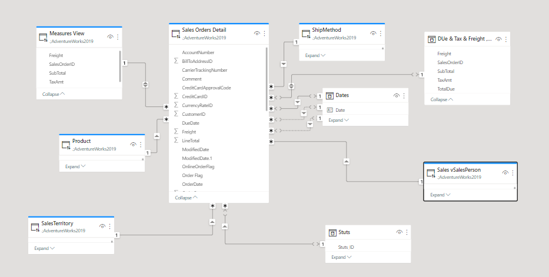
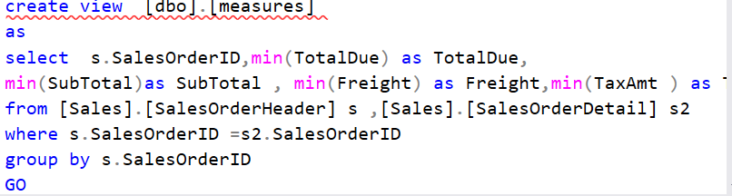
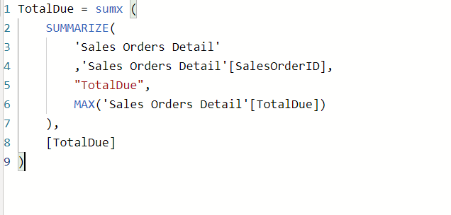

# Sales
### 1.ETL
##### Collecting Data From  MS Sql Serve Using (AdventureWork Database) And Using Power Query For Making Transformation
### 2.Date Warehouse Design
##### Make Date Warehouse Design By Using Power BI Model

### 3.Making Analysis For Data
##### Using Sql Queries And DAX  For Making Analysis On Data 

